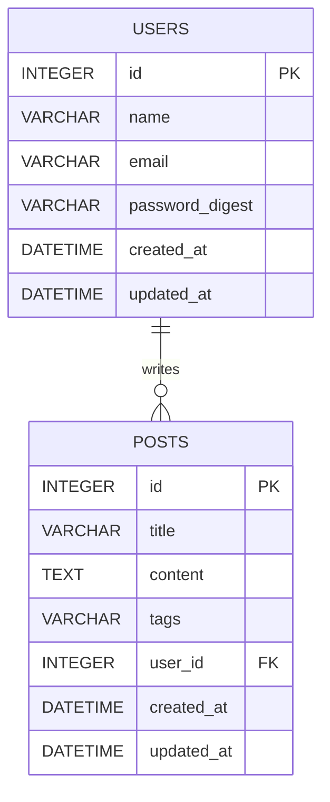

# OSKLink（部内掲示板アプリ）

このプロジェクトは 技育CAMP2025 Vol.3 で制作した掲示板アプリです。  
私は主にフロントエンドを担当し、投稿画面などを制作しました。
  
使用技術  
フロントエンド：Next.js  
バックエンド：Ruby on Rails  
データベース：SQLite  
環境構築：Docker  
  
オリジナルリポジトリ  
https://github.com/kouki-ozawa/OSK-BBS-app  
  
  
====================================
  
## 概要
下記構成の開発環境をdockerで構築できます。

## 構成

- **backend**: Ruby on Rails + SQLite  
  - Railsの設定でSQLiteのDBファイルは通常ファイルシステム上に作成されます。
  - Docker Composeでは、ホストとのボリュームマウントは行っていませんが、必要に応じて設定できます。

- **frontend**: Next.js  
  - frontendフォルダ内はNext.jsプロジェクトとして構築されています。
  - npm run devで開発サーバが起動します。

## 起動方法

1. プロジェクトルートで以下を実行
    ```bash
    docker-compose up --build
    ```
2. backendはポート3002、frontendはポート3001でアクセス可能です。

## DB ER 図



